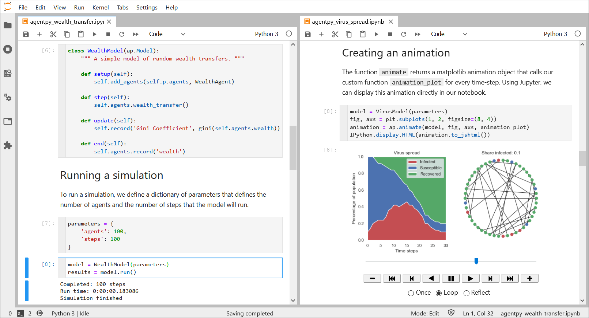

.. currentmodule:: agentpy

========================================
Agentpy - Agent-based modeling in Python
========================================

.. image:: https://img.shields.io/pypi/v/agentpy.svg
    :target: https://pypi.org/project/agentpy/
.. image:: https://img.shields.io/github/license/joelforamitti/agentpy
    :target: https://github.com/JoelForamitti/agentpy/blob/master/LICENSE
.. image:: https://travis-ci.com/JoelForamitti/agentpy.svg?branch=master
    :target: https://travis-ci.com/JoelForamitti/agentpy
.. image:: https://readthedocs.org/projects/agentpy/badge/?version=latest
    :target: https://agentpy.readthedocs.io/en/latest/?badge=latest
.. image:: https://codecov.io/gh/JoelForamitti/agentpy/branch/master/graph/badge.svg?token=NTW99HNGB0
    :target: https://codecov.io/gh/JoelForamitti/agentpy

.. raw:: latex

    \chapter{Introduction}

Agentpy is an open-source library for the development and analysis of agent-based models in Python.
The framework integrates the tasks of model design, numerical experiments,
and data analysis within a single environment, and is optimized for interactive computing
with `IPython <http://ipython.org/>`_ and `Jupyter <https://jupyter.org/>`_.
If you have questions or ideas for improvements, please visit the
`discussion forum <https://github.com/JoelForamitti/agentpy/discussions>`_
or subscribe to the `agentpy mailing list <https://groups.google.com/g/agentpy/about>`_.

.. rubric:: Quick orientation

- To get started, please take a look at :doc:`installation` and :doc:`overview`.
- For a simple demonstration, check out the :doc:`agentpy_wealth_transfer` tutorial in the :doc:`model_library`.
- For a detailled description of all classes and functions, refer to :doc:`reference`.
- To learn how agentpy compares with other frameworks, take a look at :doc:`comparison`.

.. rubric:: Example

*A screenshot of Jupyter Lab with two interactive tutorials from the model library:*

.. only:: html

    .. rubric:: Table of contents

.. toctree::
   :maxdepth: 2

   installation
   overview
   guide
   model_library
   reference
   comparison
   changelog
   contributing
   about

.. only:: html

    .. rubric:: Indices and tables
    
    * :ref:`genindex`
    * :ref:`search`