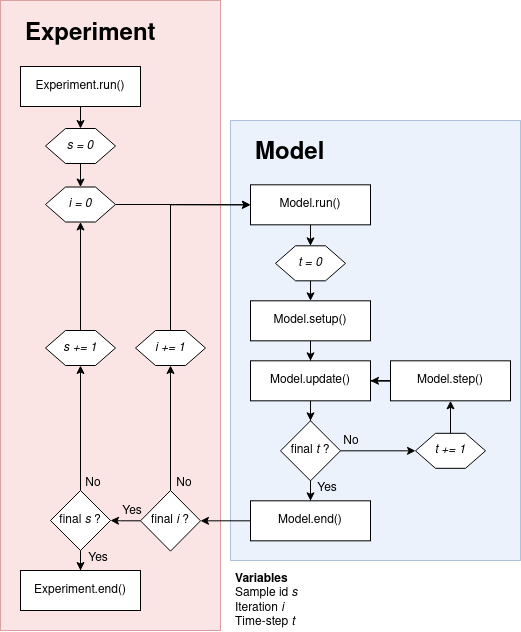

.. currentmodule:: agentpy

========
Overview
========

This section provides an overview over the main classes and
functions of AgentPy and how they are meant to be used.
For a more detailed description of each element,
please refer to the :doc:`guide` and :doc:`reference`.
Throughout this documentation, AgentPy is imported as follows::

    import agentpy as ap

Structure
#########

The basic structure of the AgentPy framework has four levels:

1. The :class:`Agent` is the basic building block of a model
2. The environment types :class:`Grid`, :class:`Space`, and :class:`Network` contain agents
3. A :class:`Model` contains agents, environments, parameters, and simulation procedures
4. An :class:`Experiment` can run a model multiple times with different parameter combinations

All of these classes are templates that can be customized through the creation of
`sub-classes <https://docs.python.org/3/tutorial/classes.html?highlight=inheritance#inheritance>`_
with their own variables and methods.

Creating models
###############

A custom agent type can be defined as follows::

    class MyAgent(ap.Agent):

        def setup(self):
            # Initialize an attribute with a parameter
            self.my_attribute = self.p.my_parameter

        def agent_method(self):
            # Define custom actions here
            pass

The method :func:`Agent.setup` is meant to be overwritten
and will be called automatically after an agent's creation.
All variables of an agents should be initialized within this method.
Other methods can represent actions that the agent will be able to take during a simulation.

All model objects (including agents, environments, and the model itself)
are equipped with the following default attributes:

- :attr:`model` the model instance
- :attr:`id` a unique identifier number for each object
- :attr:`p` the model's parameters
- :attr:`log` the object's recorded variables

Using the new agent type defined above,
here is how a basic model could look like::

    class MyModel(ap.Model):

        def setup(self):
            """ Initiate a list of new agents. """
            self.agents = ap.AgentList(self, self.p.agents, MyAgent)

        def step(self):
            """ Call a method for every agent. """
            self.agents.agent_method()

        def update(self):
            """ Record a dynamic variable. """
            self.agents.record('my_attribute')

        def end(self):
            """ Repord an evaluation measure. """
            self.report('my_measure', 1)

The simulation procedures of a model are defined by four special methods
that will be used automatically during different parts of a simulation.

- :class:`Model.setup` is called at the start of the simulation (`t==0`).
- :class:`Model.step` is called during every time-step (excluding `t==0`).
- :class:`Model.update` is called after every time-step (including `t==0`).
- :class:`Model.end` is called at the end of the simulation.

If you want to see a basic model like this in action,
take a look at the :doc:`agentpy_wealth_transfer` demonstration in the :doc:`model_library`.

.. _overview_agents:

Agent sequences
###############

The :doc:`reference_sequences` module provides containers for groups of agents.
The main classes are :class:`AgentList`, :class:`AgentDList`, and :class:`AgentSet`,
which come with special methods to access and manipulate whole groups of agents.

For example, when the model defined above calls :func:`self.agents.agent_method`,
it will call the method :func:`MyAgentType.agent_method` for every agent in the model.
Similar commands can be used to set and access variables, or select subsets
of agents with boolean operators.
The following command, for example, selects all agents with an id above one::

    agents.select(agents.id > 1)

Further examples can be found in :doc:`reference_sequences`
and the :doc:`agentpy_virus_spread` demonstration model.

.. _overview_environments:

Environments
############

:doc:`reference_environments` are objects in which agents can inhabit a specific position.
A model can contain zero, one or multiple environments which agents can enter and leave.
The connection between positions is defined by the environment's topology.
There are currently three types:

- :class:`Grid` n-dimensional spatial topology with discrete positions.
- :class:`Space` n-dimensional spatial topology with continuous positions.
- :class:`Network` graph topology consisting of :class:`AgentNode` and edges.

Applications of networks can be found in the demonstration models
:doc:`agentpy_virus_spread` and :doc:`agentpy_button_network`;
spatial grids in :doc:`agentpy_forest_fire` and :doc:`agentpy_segregation`;
and continuous spaces in :doc:`agentpy_flocking`.
Note that there can also be models without environments like in :doc:`agentpy_wealth_transfer`.

Recording data
##############

There are two ways to document data from the simulation for later :ref:`analysis <overview_analysis>`.

The first way is to record dynamic variables,
which can be recorded for each object (agent, environment, or model) and time-step.
They are useful to look at the dynamics of individual or aggregate objects over time
and can be documented by calling the method :meth:`record` for the respective object.
Recorded variables can at run-time with the object's `log` attribute.

The second way is to document reporters,
which represent summary statistics or evaluation measures of a simulation.
In contrast to variables, reporters can be stored only for the model as a whole and only once per run.
They will be stored in a separate dataframe for easy comparison over multiple runs,
and can be documented with the method :meth:`Model.report`.
Reporters can be accessed at run-time via :attr:`Model.reporters`.

.. _overview_simulation:

Running a simulation
####################

To perform a simulation, we initialize a new instance of our model type
with a dictionary of parameters, and then use the function :func:`Model.run`.
This will return a :class:`DataDict` with recorded data from the simulation.
A simple run can be prepared and executed as follows::

    parameters = {
        'my_parameter':42,
        'agents':10,
        'steps':10
    }

    model = MyModel(parameters)
    results = model.run()

A simulation proceeds as follows (see also Figure 1 below):

0. The model initializes with the time-step :attr:`Model.t = 0`.
1. :func:`Model.setup` and :func:`Model.update` are called.
2. The model's time-step is increased by 1.
3. :func:`Model.step` and :func:`Model.update` are called.
4. Step 2 and 3 are repeated until the simulation is stopped.
5. :func:`Model.end` is called.

The simulation of a model can be stopped by one of the following two ways:

1. Calling the :func:`Model.stop` during the simulation.
2. Reaching the time-limit, which be defined as follows:

   - Defining :attr:`steps` in the paramater dictionary.
   - Passing :attr:`steps` as an argument to :func:`Model.run`.

Interactive simulations
#######################

Within a Jupyter Notebook,
AgentPy models can be explored as an interactive simulation
(similar to the traditional NetLogo interface)
using `ipysimulate <https://github.com/JoelForamitti/ipysimulate>`_ and `d3.js <https://d3js.org/>`_.
For more information on this, please refer to :doc:`guide_interactive`.

.. _overview_experiments:

Multi-run experiments
#####################

The :doc:`reference_sample` module provides tools to create a :class:`Sample`
with multiple parameter combinations from a dictionary of ranges.
Here is an example using :class:`IntRange` integer ranges::

    parameters = {
        'my_parameter': 42,
        'agents': ap.IntRange(10, 20),
        'steps': ap.IntRange(10, 20)
    }
    sample = ap.Sample(parameters, n=5)

The class :class:`Experiment` can be used to run a model multiple times.
As shown in Figure 1, it will start with the first parameter combination
in the sample and repeat the simulation for the amount of defined iterations.
After, that the same cycle is repeated for the next parameter combination.

   Figure 1: Chain of events in :class:`Model` and :class:`Experiment`.

Here is an example of an experiment with the model defined above.
In this experiment, we use a sample where one parameter is kept fixed
while the other two are varied 5 times from 10 to 20 and rounded to integer.
Every possible combination is repeated 2 times, which results in 50 runs::

    exp = ap.Experiment(MyModel, sample, iterations=2, record=True)
    results = exp.run()

For more applied examples of experiments, check out the demonstration models
:doc:`agentpy_virus_spread`, :doc:`agentpy_button_network`, and :doc:`agentpy_forest_fire`.
An alternative to the built-in experiment class is to use AgentPy models with
the EMA workbench (see :doc:`guide_ema`).

Random numbers
##############

:class:`Model` contains two random number generators:

- :attr:`Model.random` is an instance of :class:`random.Random`
- :attr:`Model.nprandom` is an instance of :class:`numpy.random.Generator`

The random seed for these generators can be set by defining a parameter `seed`.
The :class:`Sample` class has an argument `randomize`
to control whether vary seeds over different parameter combinations.
Similarly, :class:`Experiment` also has an argument `randomize`
to control whether to vary seeds over different iterations.
More on this can be found in :doc:`guide_random`.

.. _overview_analysis:

Data analysis
#############

Both :class:`Model` and :class:`Experiment` can be used to run a simulation,
which will return a :class:`DataDict` with output data.
The output from the experiment defined above looks as follows::

    >>> results
    DataDict {
    'info': Dictionary with 5 keys
    'parameters':
        'constants': Dictionary with 1 key
        'sample': DataFrame with 2 variables and 25 rows
    'variables':
        'MyAgent': DataFrame with 1 variable and 10500 rows
    'reporters': DataFrame with 1 variable and 50 rows
    }

All data is given in a :class:`pandas.DataFrame` and
formatted as `long-form data <https://seaborn.pydata.org/tutorial/data_structure.html>`_
that can easily be used with statistical packages like `seaborn <https://seaborn.pydata.org/>`_.
The output can contain the following categories of data:

- :attr:`info` holds meta-data about the model and simulation performance.
- :attr:`parameters` holds the parameter values that have been used for the experiment.
- :attr:`variables` holds dynamic variables, which can be recorded at multiple time-steps.
- :attr:`reporters` holds evaluation measures that are documented only once per simulation.
- :attr:`sensitivity` holds calculated sensitivity measures.

The :class:`DataDict` provides the following main methods to handle data:

- :func:`DataDict.save` and :func:`DataDict.load` can be used to store results.
- :func:`DataDict.arrange` generates custom combined dataframes.
- :func:`DataDict.calc_sobol` performs a Sobol sensitivity analysis.

Visualization
#############

In addition to the :doc:`guide_interactive`,
AgentPy provides the following functions for visualization:

- :func:`animate` generates an animation that can display output over time.
- :func:`gridplot` visualizes agent positions on a spatial :class:`Grid`.

To see applied examples of these functions, please check out the :doc:`model_library`.