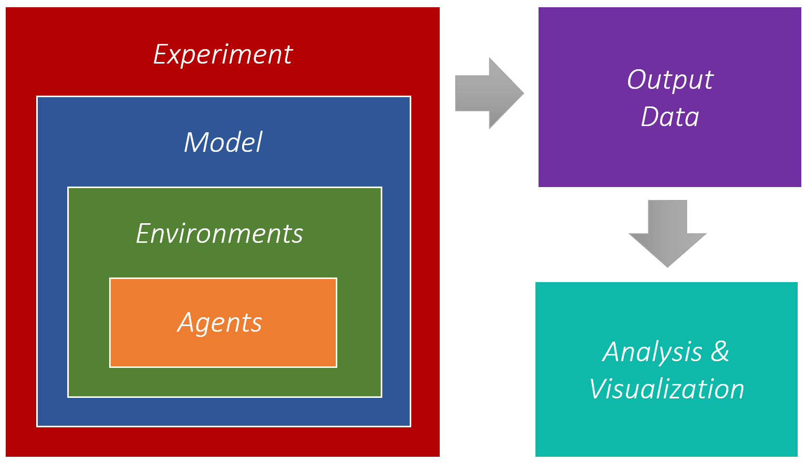

# Introduction

Agent-based models allow for computer simulations based on the autonomous behavior of heterogeneous agents. They are used to generate and understand the emergent dynamics of complex systems, with applications in fields like ecology [@DeAngelis2019], cognitive sciences [@Madsen2019], management [@North2007], policy analysis [@Castro2020], economics [@Arthur2021; @Farmer2009], and sociology [@Bianchi2015].

AgentPy is an open-source library for the development and analysis of agent-based models. It aims to provide an intuitive syntax for the creation of models together with advanced tools for scientific applications. The framework is written in Python 3, and optimized for interactive computing with [IPython](http://ipython.org/) and [Jupyter](https://jupyter.org/). A reference of all features as well as a model library with tutorials and examples can be found in the [documentation](https://agentpy.readthedocs.io/).[^1]

# Statement of Need

There are numerous modeling and simulation tools for agent-based models, each with their own particular focus and style [@Abar2017]. Notable examples are NetLogo [@Netlogo], which is written in Scala/Java and has become the most established tool in the field; and [Mesa](https://mesa.readthedocs.io/), a more recent framework that has popularized the development of agent-based models in Python.[^2]

A main distinguishing feature of AgentPy is that it integrates the many different tasks of agent-based modeling within a single environment for interactive computing. This includes the creation of custom agent and model types; interactive simulations (similar to the traditional NetLogo interface); numeric experiments over multiple runs; and the subsequent data analysis of the output. All of these can be performed within a [Jupyter Notebook](https://jupyter.org/).

The software is further designed for scientific applications, and includes tools for parameter sampling (similar to NetLogo's BehaviorSpace), Monte Carlo experiments, random number generation, parallel computing, and sensitivity analysis. Beyond these built-in features, AgentPy is also designed for compatibility with established Python packages like [EMA Workbench](https://emaworkbench.readthedocs.io/), [NetworkX](https://networkx.org/), [NumPy](https://numpy.org/), [pandas](https://pandas.pydata.org/), [SALib](https://salib.readthedocs.io/), [SciPy](https://www.scipy.org/), and [seaborn](https://seaborn.pydata.org/).

# Basic structure

The AgentPy framework follows a nested structure that is illustrated in \autoref{fig:structure}. The basic building blocks are the agents, which can be placed within (multiple) environments with different topologies such as a network, a spatial grid, or a continuous space. Models are used to initiate these objects, perform a simulation, and record data. Experiments can run a model over multiple iterations and parameter combinations. The resulting output data can then be saved and re-arranged for analysis and visualization.

{ width=60% }

# Model example

The following code shows an example of a simple model that explores the distribution of wealth under a randomly trading population of agents. The original version of this model was written in Mesa, allowing for a comparison of the syntax between the two frameworks.[^3] To start, we import the AgentPy library as follows:

```python
import agentpy as ap
```

We then define a new type of [`Agent`](https://agentpy.readthedocs.io/en/stable/reference_agents.html). The method [`setup`](https://agentpy.readthedocs.io/en/stable/reference_agents.html#agentpy.Agent.setup) will be called automatically at the agent's creation. Each agent starts with one unit of wealth. `wealth_transfer` will be called by the model during each time-step. When called, the agent randomly selects a trading partner and hands them one unit of their wealth, given that they have one to spare. 

```python
class WealthAgent(ap.Agent):

    def setup(self):
        self.wealth = 1

    def wealth_transfer(self):
        if self.wealth > 0:
            partner = self.model.agents.random()
            partner.wealth += 1
            self.wealth -= 1
```

Next, we define a [`Model`](https://agentpy.readthedocs.io/en/stable/reference_model.html). The method [`setup`](https://agentpy.readthedocs.io/en/stable/reference_model.html#agentpy.Model.setup) is called at the beginning the simulation, [`step`](https://agentpy.readthedocs.io/en/stable/reference_model.html#agentpy.Model.step) is called during each time-step, and [`end`](https://agentpy.readthedocs.io/en/stable/reference_model.html#agentpy.Model.end) is called after the simulation has finished. An [`AgentList`](https://agentpy.readthedocs.io/en/stable/reference_sequences.html) is used to create a set of agents that can then be accessed as a group. The attribute `p` is used to access the model's parameters. And the method [`record`](https://agentpy.readthedocs.io/en/stable/reference_agents.html#agentpy.Agent.record) is used to store data for later analysis.

```python
class WealthModel(ap.Model):

    def setup(self):
        self.agents = ap.AgentList(self, self.p.n, WealthAgent)

    def step(self):
        self.agents.wealth_transfer()

    def end(self):
        self.agents.record('wealth')
```

To run a simulation, a new instance of the model is created with a dictionary of parameters.
While the parameter `n` is used in the model's setup, the parameter `steps` automatically defines the maximum number of time-steps. Alternatively, the simulation could also be stopped with [`Model.stop`](https://agentpy.readthedocs.io/en/stable/reference_model.html#agentpy.Model.stop). To perform the actual simulation, one can use [`Model.run`](https://agentpy.readthedocs.io/en/stable/reference_model.html#agentpy.Model.run).

```python
parameters = {'n': 100, 'steps': 100}
model = MoneyModel(parameters)
results = model.run()
```

Parameters can also be defined as ranges and used to generate a [`Sample`](https://agentpy.readthedocs.io/en/stable/reference_sample.html).
This sample can then be used to initiate an [`Experiment`](https://agentpy.readthedocs.io/en/stable/reference_experiment.html) that can repeatedly run the model over multiple parameter combinations and iterations. In the following example, the parameter `n` is varied from 1 to 100 and the simulation is repeated 10 times for each value of `n`.

```python
parameters = {'n': ap.IntRange(1, 100), 'steps': 100}
sample = ap.Sample(parameters, n=10)
exp = ap.Experiment(MoneyModel, sample, iterations=10, record=True)
results = exp.run()
```

The output of both models and experiments is given as a [`DataDict`](https://agentpy.readthedocs.io/en/stable/reference_data.html) with tools to save, arrange, and analyse data. Here, we use the seaborn library to display a histogram of the experiment's output. The plot is presented in \autoref{fig:boltzmann}. It shows that the random interaction of the agents creates an inequality of wealth that resembles a Boltzmann-Gibbs distribution. 

```python
import seaborn as sns
sns.histplot(data=results.variables.MoneyAgent, binwidth=1)
```

{ width=50% }

More examples - including spatial environments, networks, stochastic processes, interactive simulation interfaces, animations, and sensitivity analysis - can be found in the [model library](https://agentpy.readthedocs.io/en/stable/model_library.html) and [user guides](https://agentpy.readthedocs.io/en/stable/guide.html) of the documentation. For questions and ideas, please visit the [discussion forum](https://github.com/JoelForamitti/agentpy/discussions).[^4]

[^1]: Link to the AgentPy documentation: [https://agentpy.readthedocs.io](https://agentpy.readthedocs.io)
[^2]: Link to the Mesa documentation: [https://mesa.readthedocs.io](https://mesa.readthedocs.io)
[^3]: For a direct comparison, see: [https://agentpy.readthedocs.io/en/stable/comparison.html](https://agentpy.readthedocs.io/en/stable/comparison.html)
[^4]: Link to the AgentPy dicussion forum: [https://github.com/JoelForamitti/agentpy/discussions](https://github.com/JoelForamitti/agentpy/discussions)

# Acknowledgements

This study has received funding through an ERC Advanced Grant from the European Research Council (ERC) under the European Union's Horizon 2020 research and innovation programme (grant agreement n° 741087).

# References